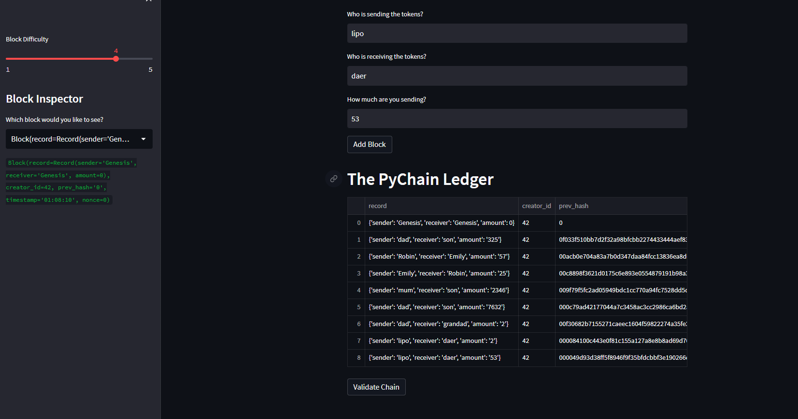
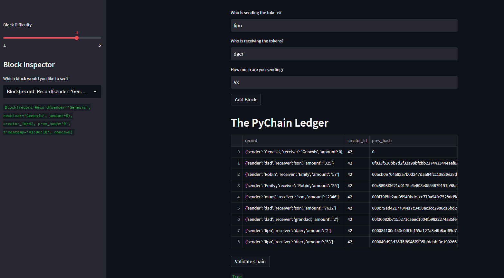

# Blockchain-in-python
## Project Description
---
Challenge 18 for fintech bootcamp through UC Berkeley. Using python to create a blockchain data structure (pychain) using classes. Then displaying that pyhcain on web app using streamlit. The result is a test blockchain data structure where the user can enter a sender, receiver, and how many tokens being sent. View the chain, and validate the chain as well. The goal of this web app is to help educate users in blockhain architecture and just messing around with a simple web app. 

---

## Package Requirements and versions
First before installing any packages and getting setup make sure you are in a `dev` environment or an environment you are comfortable downloading packages into. If you don't know what a `dev` environment is follow along below. 
To get your `dev` environment setup do the following in your command line:

- Creating a dev environment for python 3.7 called 'dev' - if you do not already have an environment setup 
    - Get setup in your preferred CLI (Gitbash, terminal, etc)
    - `conda create -n dev python=3.7 anaconda`
    - Once you have created the environment, type the following to activate and deactivate.

Once you have cloned the repo and have a `dev` or similar env with python 3.7 or higher the next step is to make sure you have the packages installed locally. Navigate to the newly cloned repo and make sure you are in the right directory. 
All you need for this might be streamlit `pip install streamlit` if you don't have it already.
Once you in the right directory and your preferred CLI tool, simply type `streamlit run pychain.py` and a local host should appear shortly looking like the screenshot in the start of this readme!

---
## Usage and Results

Once you are on the web app, just add some data to the sender, receiver and amount sections and hit add block to add to the pychain ledger below. If you want to validate the chain and make sure each block is containing a correct hash of the block before. Hit the validate button and you should see a green 'true' show up like the photo below.

Letting you know that the chain is successfully stacked and in the right order. Feel free to add any data and on the left side you can view all the blocks and the data inside the block to get a sneak peak into the data.

---

## Contributors

[Robin Thorsen](https://www.linkedin.com/in/robin-thorsen-079819120/), [Kaio Farkouh](https://www.linkedin.com/in/kaio-farkouh/), [Zach Eras](https://www.linkedin.com/in/zachary-eras-24b5a8149/) are the developers/analysts who worked on this project. 

---

## License

Apache 2.0 public License applied, feel free to clone and fork and use and reach out if you have questions. 

